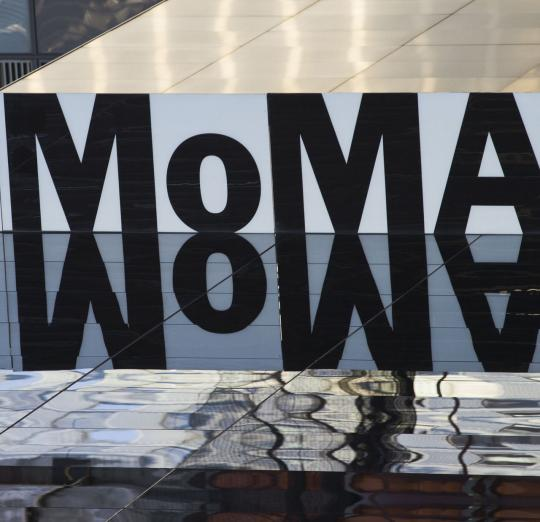

    

# Museum of Modern Art Analysis
*Moma dataset analyzed with python and its packages*
---

We will be working with a data set from [data.world](https://data.world/moma/collection). 
These are data sets of artworks and artists maintained by [Museum of Modern Arts](https://www.moma.org/) in New York. 
I'll implement techniques to tidy up datasets, and then tinker with and analyze them. 
I will be using python's built in package csv along with some simple functions and loops throughout this project. 
There are great packages(numpy, pandas, etc.) for data analysis but in this project I use the basics.

---
In this project we shall :

## Clean the dataset:

- Check length of each row and delete outliers to avoid indexing problems.
- Because many artworks(rows) have multiple data per index(multiple artists) associated with them, we'll convert them(index=1 through index=8) to lists.
- Strip data of extra string characters, and convert(to integers where possible).
- Fill empty row indices(`nationality`, `gender`, `date`, etc.) with appropiate data.

## Analyze the Data:

- Calculate how old the artist was when they created their artwork
- Count artist frequency in `artworks`
- Analyze and interpret the distribution of artist ages
- Create functions which summarize our data
- Print summaries in an easy-to-read-way 

